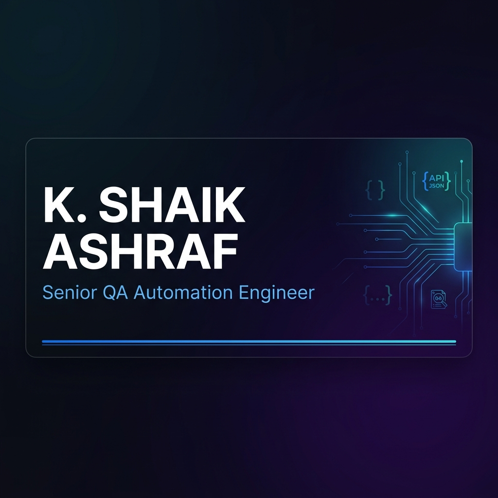

<!-- ═══════════════════════════════════════════════════════════ -->
<!--                   PREMIUM BANNER HEADER                    -->
<!-- ═══════════════════════════════════════════════════════════ -->
<div align="center">



<br/>

<!-- Typing Animation -->


<br/><br/>

<!-- Badge Row -->
<a href="https://github.com/Alpha-ashu">

</a>
&nbsp;

&nbsp;

&nbsp;

&nbsp;


</div>

<br/>

<!-- ═══════════════════════════════════════════════════════════ -->
<!--                      ABOUT ME SECTION                      -->
<!-- ═══════════════════════════════════════════════════════════ -->
<table>
<tr>
<td valign="top" width="60%">

## 🧑‍💻 About Me

```yaml
Role       : Senior QA Automation Engineer
Experience : 5+ Years
Domains    : Healthcare | E-Commerce | AI/ML
Cert       : ISTQB® CTFL
Languages  : English | Tamil | Hindi
Focus      : API Automation | Framework Design
```

<br/>

- ⚙️ Architecting **Karate + Java** engines validating thousands of API records per regression cycle
- 🐍 Writing **Python utilities** for JSON comparison — normalising dynamic fields & date formats
- 🔌 Building CI/CD pipelines with **Jenkins + Git** for continuous test execution
- 🤖 Exploring **AI Testing · MCP · RAG · Agentic AI · LLM-Powered QA**
- 📐 Passionate about clean framework design and disciplined delivery

</td>
<td valign="top" width="40%" align="center">

<br/><br/>


</td>
</tr>
</table>

<br/>

<!-- ═══════════════════════════════════════════════════════════ -->
<!--                    CONNECT WITH ME                         -->
<!-- ═══════════════════════════════════════════════════════════ -->
<div align="center">

## 🌐 Connect With Me

[](https://www.linkedin.com/in/shaik-ashraf-a1768b115/)
[](mailto:shaik.job.details@gmail.com)
[](https://github.com/Alpha-ashu)

</div>

<br/>

<!-- ═══════════════════════════════════════════════════════════ -->
<!--                  PROFESSIONAL EXPERIENCE                   -->
<!-- ═══════════════════════════════════════════════════════════ -->
## 💼 Professional Experience

<table>
<tr>
<td>

**🏢 Senior QA Automation Engineer (Contract)** &nbsp;`Nov 2024 – Present`

> 🏥 **Domain:** Healthcare — Legacy to Modern System Migration

- 🏗️ Built an enterprise-level **API test framework from scratch** using Karate & Java to validate data consistency between legacy and migrated healthcare systems
- 🐍 Wrote reusable **Python utilities** for JSON comparison — normalizing dynamic fields and date formats before each check
- 📊 Implemented efficient logic comparing **thousands of API records per run** with automated reporting for daily regression cycles
- 🔌 Verified backend behavior via **REST calls + SQL queries**; wired framework into **Git & Jenkins** for continuous execution
- 👤 Owned the framework **end-to-end as sole engineer**, partnering directly with client stakeholders on requirements & defect triage
- 📋 Tracked execution & defects in **Rally**; contributed to Sprint Planning, Reviews, Daily Scrums & Retrospectives

`Java` `Karate` `REST API` `JSON` `SQL` `Python` `Jenkins` `Git` `Rally` `Agile`

</td>
</tr>
<tr>
<td>

**🏥 Associate Software Product Tester** &nbsp;`Jul 2021 – May 2023`

> 🖥️ **Domain:** Healthcare — Enterprise Web, Mobile & Windows Applications

- 🤖 Built a **Selenium WebDriver / TestNG** UI suite on a data-driven design for consistent cross-release coverage
- 🔗 Verified REST endpoints with **Postman & REST Assured**; confirmed data integrity with direct **SQL queries**
- 📱 Extended coverage to **mobile via Appium**; triaged issues in **HP ALM & Jira** with developers, POs & BAs
- 🏥 Covered patient portal, nurse tools, medication management, laboratory, billing & clinical workflow modules

`Java` `Selenium` `TestNG` `REST Assured` `SQL` `Jira` `HP ALM` `Appium`

</td>
</tr>
<tr>
<td>

**🛒 Digital Associate — QA** &nbsp;`Sep 2019 – Mar 2021`

> 🤖 **Domain:** AI / Machine Learning — Annotation Tools & Ground-Truth Datasets

- 🧠 Supported an **AI robot initiative** — verified annotation-tool accuracy & curated ground-truth datasets for the ML team
- 🧪 Ran functional test cycles on web applications; wrote **Java-Selenium scripts** to cut repetitive manual effort
- 🗄️ Cross-checked data via **SQL**; tracked issues in **Jira**

`Java` `Selenium` `SQL` `Jira` `Machine Learning` `Manual Testing`

</td>
</tr>
</table>

<br/>

<!-- ═══════════════════════════════════════════════════════════ -->
<!--                       TECH STACK                          -->
<!-- ═══════════════════════════════════════════════════════════ -->
## ⚙️ Tech Stack

<table>
<tr>
<td align="center" width="25%">

**🔤 Languages**


</td>
<td align="center" width="25%">

**🧪 UI Automation**


<br/>


</td>
<td align="center" width="25%">

**🔗 API Automation**


<br/>


</td>
<td align="center" width="25%">

**🚀 DevOps & Tools**


<br/>


</td>
</tr>
</table>

<br/>

**🧰 Test Coverage**

```
✅ Functional   ✅ Regression   ✅ Smoke        ✅ Sanity
✅ Integration  ✅ System       ✅ End-to-End   ✅ API/Backend
✅ Mobile       ✅ Data-Driven  ✅ BDD/Cucumber  ✅ Hybrid Framework
```

<br/>

<!-- ═══════════════════════════════════════════════════════════ -->
<!--                    KEY ACHIEVEMENTS                        -->
<!-- ═══════════════════════════════════════════════════════════ -->
## 🏆 Key Achievements

<table>
<tr>
<td width="50%">

🚀 **Production-Grade Framework**
Delivered a solo enterprise API framework for a large healthcare migration — eliminated significant manual regression cycles

</td>
<td width="50%">

🔬 **JSON Comparison Engine**
Built a reusable engine handling **thousands of record checks per CI run** with automated daily reporting

</td>
</tr>
<tr>
<td width="50%">

🥇 **Employee of the Quarter**
Awarded for measurable process improvements in an AI/ML domain QA role

</td>
<td width="50%">

👑 **Team Leadership Recognition**
Recognized for independently leading end-to-end QA activities across enterprise healthcare modules

</td>
</tr>
</table>

<br/>

<!-- ═══════════════════════════════════════════════════════════ -->
<!--                    FEATURED PROJECTS                       -->
<!-- ═══════════════════════════════════════════════════════════ -->
## 📌 Featured Projects

<table>
<tr>
<td width="50%">

### 🔥 Karate API Framework


Production-grade REST API comparison engine for healthcare system migration. Python JSON normalisation utilities + automated daily regression reporting. Handles thousands of record comparisons per CI run.

</td>
<td width="50%">

### 🧪 Selenium Automation Framework


Enterprise Hybrid Framework — Data-Driven + Page Object Model design. Login, search, checkout, cart & payment flows. Screenshot utility, retry logic & Extent Reports.

</td>
</tr>
<tr>
<td width="50%">

### ⚡ Playwright Automation Framework


Cross-browser testing, parallel execution, HTML reports & CI/CD integration. Modern async-first architecture for fast, reliable test runs.

</td>
<td width="50%">

### 🤖 AI-Powered QA Exploration


Exploring LLM-powered test generation, MCP protocol, RAG pipelines & Agentic AI workflows integrated into the modern QA lifecycle.

</td>
</tr>
</table>

<br/>

<!-- ═══════════════════════════════════════════════════════════ -->
<!--                     GITHUB ANALYTICS                       -->
<!-- ═══════════════════════════════════════════════════════════ -->
## 📊 GitHub Analytics

<div align="center">

<table>
<tr>
<td>

</td>
<td>

</td>
</tr>
</table>

<br/>


</div>

<br/>

<!-- ═══════════════════════════════════════════════════════════ -->
<!--                    GITHUB TROPHIES                         -->
<!-- ═══════════════════════════════════════════════════════════ -->
## 🏅 GitHub Trophies

<div align="center">


</div>

<br/>

<!-- ═══════════════════════════════════════════════════════════ -->
<!--                   CONTRIBUTION GRAPH                       -->
<!-- ═══════════════════════════════════════════════════════════ -->
## 📈 Contribution Graph

<div align="center">


</div>

<br/>

<!-- ═══════════════════════════════════════════════════════════ -->
<!--               CONTRIBUTION SNAKE ANIMATION                 -->
<!-- ═══════════════════════════════════════════════════════════ -->
## 🐍 Contribution Snake

<div align="center">

<picture>
  <source media="(prefers-color-scheme: dark)" srcset="https://raw.githubusercontent.com/Alpha-ashu/Alpha-ashu/output/github-contribution-grid-snake-dark.svg"/>
  <source media="(prefers-color-scheme: light)" srcset="https://raw.githubusercontent.com/Alpha-ashu/Alpha-ashu/output/github-contribution-grid-snake.svg"/>
  
</picture>

</div>

<br/>

<!-- ═══════════════════════════════════════════════════════════ -->
<!--                  EDUCATION & CERTS                         -->
<!-- ═══════════════════════════════════════════════════════════ -->
## 🎓 Education & Certifications

<table>
<tr>
<td width="55%">

### 📚 Education

| Degree | Year |
|---|---|
| **MCA** — Master of Computer Applications | 2023 – 2025 |
| **B.Sc.** — Physics | 2014 – 2017 |

</td>
<td width="45%" align="center">

### 🏅 Certification

<br/>


<br/><br/>

*International Software Testing Qualifications Board*

</td>
</tr>
</table>

<br/>

<!-- ═══════════════════════════════════════════════════════════ -->
<!--                   CURRENTLY EXPLORING                      -->
<!-- ═══════════════════════════════════════════════════════════ -->
## 🌱 Currently Exploring

<div align="center">


</div>

<br/>

<!-- ═══════════════════════════════════════════════════════════ -->
<!--                    EXPERTISE MAP                           -->
<!-- ═══════════════════════════════════════════════════════════ -->
## 🔍 Expertise Map

```text
🧪 Test Automation      ████████████████████  100%
🔗 API Testing          ████████████████████  100%
⚡ Karate Framework     ████████████████████  100%
🌐 Selenium WebDriver   ████████████████████  100%
☕ Java                 ██████████████████░░   90%
🗄️ SQL                  █████████████████░░░   85%
🐍 Python               ████████████████░░░░   80%
🔄 CI/CD Pipeline       ████████████████░░░░   80%
🎭 Playwright           ████████░░░░░░░░░░░░   40%  [Learning]
🤖 AI / LLM Testing     ██████░░░░░░░░░░░░░░   30%  [Exploring]
```

<br/>

<!-- ═══════════════════════════════════════════════════════════ -->
<!--                      PHILOSOPHY                            -->
<!-- ═══════════════════════════════════════════════════════════ -->
<div align="center">

---

### 💡 Philosophy

> *"First, solve the problem. Then, automate the solution."*

> *"Quality is not an act, it is a habit."* — Aristotle

---

### 🤝 Open to Opportunities

*Senior QA Automation | API Framework Design | Healthcare Domain*

[](mailto:shaik.job.details@gmail.com)
&nbsp;
[](https://www.linkedin.com/in/shaik-ashraf-a1768b115/)

<br/><br/>

### ⭐ Thanks for visiting my profile! ⭐


</div>
