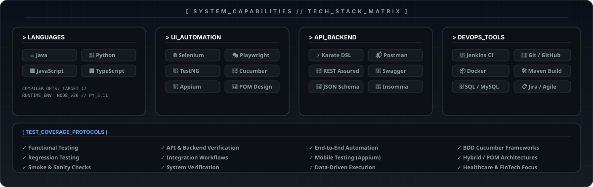
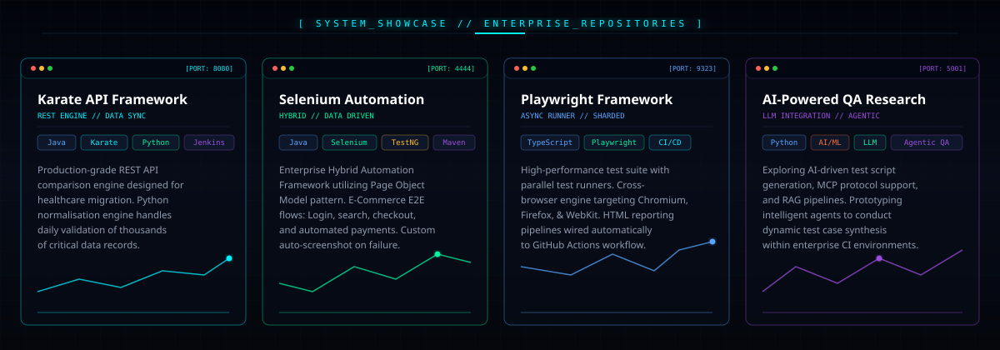
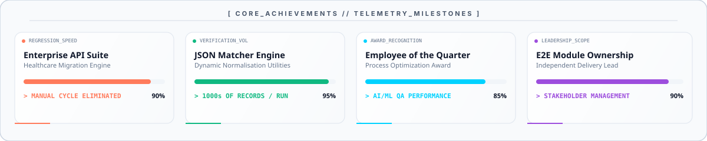
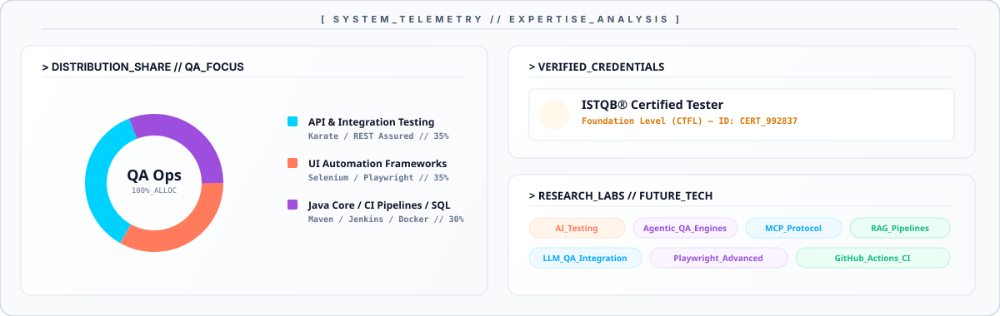

<!-- ╔══════════════════════════════════════════════════════════════╗ -->
<!-- ║               GLASSMORPHISM HEADER                           ║ -->
<!-- ╚══════════════════════════════════════════════════════════════╝ -->
<div align="center">



<br/>


</div>

---

<!-- ╔══════════════════════════════════════════════════════════════╗ -->
<!-- ║                     ABOUT ME + GIF                           ║ -->
<!-- ╚══════════════════════════════════════════════════════════════╝ -->

<table width="100%">
<tr>
<td valign="top" width="58%">

## 🧑‍💻 About Me

```yaml
Role       : Senior QA Automation Engineer
Experience : 5+ Years
Domains    : Healthcare | FinTech | E-Commerce | AI/ML
Cert       : ISTQB® CTFL
Status     : Vibe Coder 🤙
Passion    : Framework Design | Automation | AI Testing
```

<br/>

- ⚙️ Architecting **Karate + Java + Python** engines validating thousands of API records per regression cycle
- 🐍 Building **Python utilities** for JSON comparison — normalising dynamic fields & date formats
- 🔌 Wiring **Jenkins + Git** for continuous CI/CD test pipelines
- 🤖 Exploring **AI Testing · MCP · RAG · Agentic AI · LLM-Powered QA**
- ✍️ Active **Vibe Coder** leveraging modern agentic workflows to build high-fidelity automation setups
- 📐 Disciplined delivery | Clean framework design | Quality-first mindset

</td>
<td valign="top" width="42%" align="center">

<br/>


</td>
</tr>
</table>


<!-- ╔══════════════════════════════════════════════════════════════╗ -->
<!-- ║                  CONNECT WITH ME                             ║ -->
<!-- ╚══════════════════════════════════════════════════════════════╝ -->

<div align="center">

## 🌐 Connect With Me

[](https://www.linkedin.com/in/shaik-ashraf-a1768b115/)
&nbsp;
[](mailto:shaik.job.details@gmail.com)
&nbsp;
[](https://github.com/Alpha-ashu)

</div>

---

<!-- ╔══════════════════════════════════════════════════════════════╗ -->
<!-- ║                  PROFESSIONAL EXPERIENCE                     ║ -->
<!-- ╚══════════════════════════════════════════════════════════════╝ -->

## 💼 Professional Experience

<details open>
<summary><b>🏢 &nbsp; Senior QA Automation Engineer &nbsp; — &nbsp; Nov 2024 · Present</b></summary>
<br/>

> 🏥 **Domain:** Healthcare — Legacy to Modern System Migration

| What I Built | Impact |
|---|---|
| Enterprise API test framework from scratch (Karate + Java) | Validates data consistency across migrated healthcare systems |
| Python JSON comparison utilities with field normalisation | Handles dynamic fields, date formats before every check |
| Automated daily regression pipeline | Compares **thousands of API records per run** with reporting |
| Git + Jenkins CI integration | Continuous execution without manual intervention |
| End-to-end ownership as sole engineer | Direct stakeholder partnership on requirements & defect triage |


</details>

<br/>

<details>
<summary><b>🏥 &nbsp; Associate Software Product Tester &nbsp; — &nbsp; Jul 2021 · May 2023</b></summary>
<br/>

> 🖥️ **Domain:** Healthcare — Enterprise Web, Mobile & Windows Applications

| What I Did | Tools |
|---|---|
| Built Selenium WebDriver / TestNG data-driven UI suite | Java, Selenium, TestNG, Maven |
| REST API validation & SQL data integrity checks | Postman, REST Assured, SQL |
| Mobile test coverage via Appium | Appium, Android/iOS |
| Defect triage with developers, POs & BAs | HP ALM, Jira |
| Covered patient portal, nurse tools, medication, billing & lab modules | Full STLC ownership |


</details>

<br/>

<details>
<summary><b>🛒 &nbsp; Digital Associate — QA &nbsp; — &nbsp; Sep 2019 · Mar 2021</b></summary>
<br/>

> 🤖 **Domain:** AI / Machine Learning — Annotation Tools & Ground-Truth Datasets

- 🧠 Verified **AI annotation-tool accuracy** & curated ground-truth datasets for the ML team
- 🧪 Ran functional web test cycles; wrote **Java-Selenium scripts** to reduce manual effort
- 🗄️ Data cross-checking via **SQL** | Issue tracking via **Jira**


</details>

---

<!-- ╔══════════════════════════════════════════════════════════════╗ -->
<!-- ║                       TECH STACK                             ║ -->
<!-- ╚══════════════════════════════════════════════════════════════╝ -->

## ⚙️ Tech Stack & Coverage

<div align="center">

</div>

---

<!-- ╔══════════════════════════════════════════════════════════════╗ -->
<!-- ║                PINNED OPEN-SOURCE PROJECTS                   ║ -->
<!-- ╚══════════════════════════════════════════════════════════════╝ -->

## 📌 Open Source Projects

<div align="center">


---

<!-- ╔══════════════════════════════════════════════════════════════╗ -->
<!-- ║                    ACHIEVEMENTS                              ║ -->
<!-- ╚══════════════════════════════════════════════════════════════╝ -->

## 🏆 Key Achievements

<div align="center">

</div>

---

<!-- ╔══════════════════════════════════════════════════════════════╗ -->
<!-- ║                   GITHUB ANALYTICS                           ║ -->
<!-- ╚══════════════════════════════════════════════════════════════╝ -->

## 📊 GitHub Analytics

<div align="center">


<br/>


</div>

---

## 📈 Activity Graph

<div align="center">


</div>

---

## 🐍 Contribution Snake

<div align="center">

<picture>
  <source media="(prefers-color-scheme: dark)"  srcset="https://raw.githubusercontent.com/Alpha-ashu/Alpha-ashu/output/github-contribution-grid-snake-dark.svg"/>
  <source media="(prefers-color-scheme: light)" srcset="https://raw.githubusercontent.com/Alpha-ashu/Alpha-ashu/output/github-contribution-grid-snake.svg"/>
  
</picture>

</div>

---

<!-- ╔══════════════════════════════════════════════════════════════╗ -->
<!-- ║                EXPERTISE & RESEARCH DIRECTORY                ║ -->
<!-- ╚══════════════════════════════════════════════════════════════╝ -->

## 📊 Expertise & Research

<div align="center">

</div>

---

<!-- ╔══════════════════════════════════════════════════════════════╗ -->
<!-- ║                     FOOTER CTA                               ║ -->
<!-- ╚══════════════════════════════════════════════════════════════╝ -->

<div align="center">

### 💡 Philosophy

> *"First, solve the problem. Then, automate the solution."*

---

### 🤝 Open to Opportunities

*Senior QA Automation · API Framework Design · Healthcare Domain · Framework Architect*

<br/>

**[ [📩 Get In Touch](mailto:shaik.job.details@gmail.com) ]** &nbsp;&nbsp;·&nbsp;&nbsp; **[ [🔗 Connect on LinkedIn](https://www.linkedin.com/in/shaik-ashraf-a1768b115/) ]**

<br/>

### ⭐ Thanks for visiting! ⭐

</div>
